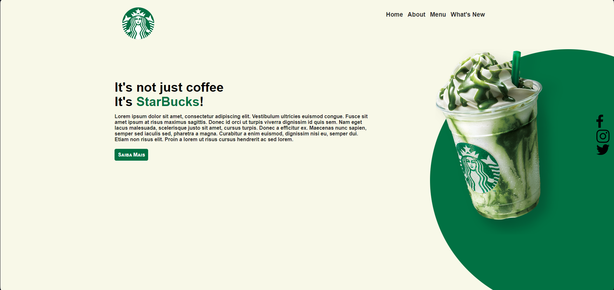

# ☕ Starbucks Landing Page

## 📝 Descrição
Este é um projeto simples de uma landing page do Starbucks, desenvolvido utilizando apenas HTML e CSS. O objetivo deste projeto foi recriar uma página de apresentação com um design limpo e moderno, destacando produtos e promoções da marca.

## 🛠️ Tecnologias Utilizadas
<ul>
  <li>HTML5: Utilizado para a estruturação semântica da página;</li>
  <li>CSS3: Utilizado para o design, incluindo layout, cores, tipografia e responsividade.</li>
</ul>

## 🎯 Objetivo do Projeto
O objetivo deste projeto foi praticar a criação de uma landing page simples, explorando boas práticas de HTML e CSS, além de técnicas de design responsivo.

## 📝 Licença
Este projeto foi criado apenas para fins educacionais e não possui afiliação oficial com o Starbucks.
